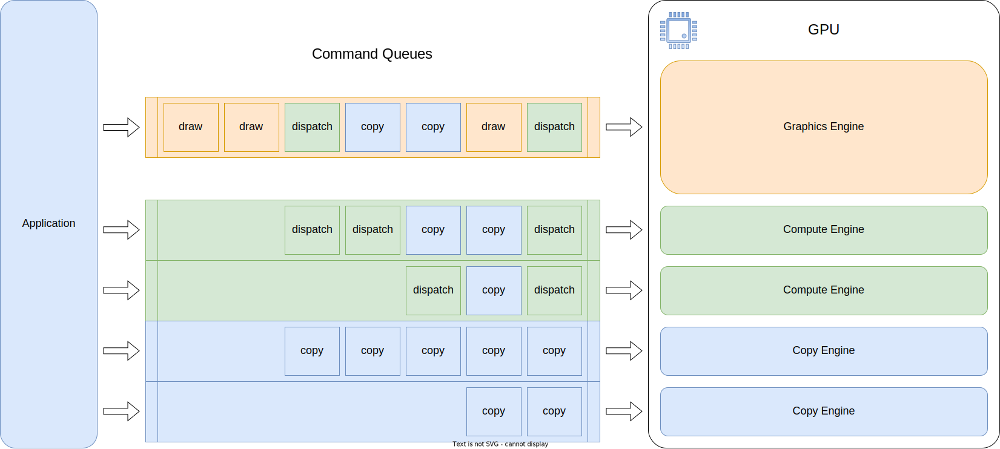
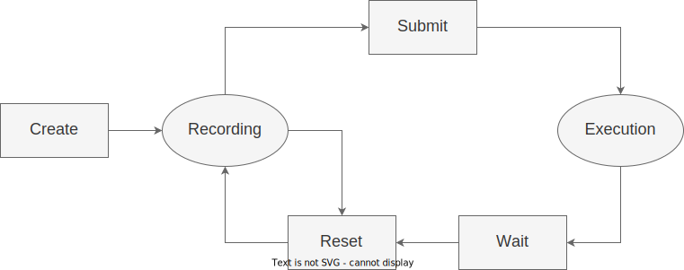

# Command Queues and Command Buffers
RHI employs a concurrent command recording and submission model, such model reduces CPU and GPU overhead by allowing multiple CPU threads and GPU engines work concurrently as much as possible, but such model also requires the user to pay more attention on how to record, submit and synchronize GPU commands. In paticular, by using the concurrent command recording and submission model, the user should pay attention to the following things:

1. How to distribute command recording work to multiple CPU threads.
1. How to submit commands recorded by multiple threads to GPU.
1. How to determine whether commands submitted to GPU have been finished.
1. How to synchronize commands submitted to different GPU queues, so they are executed in correct order.

## Command Queues

**Commands queues** are FIFO (first-in-first-out) queues used by the application to submit commands to GPU. The appliaction can submit commands to one specific queue, which pushes such commands to the back of the queue; GPU engine will pop commands from the front of the queue, and executes such commands in the order they are submitted to the queue.

One device may have one or multiple command queues. Command queues are initialized when creating the device, and can be used for submitting commands right after the device is created. Command queues have three types: **graphics**, **compute** and **copy**:

* Graphics command queues can accept graphics, compute and copy commands.
* Compute command queues can accept compute and copy commands.
* Copy command queues accepts only copy commands. 

Every device has at least one graphics command queue that accepts all kinds of commands, some GPUs may have additional compute and copy engine that can run compute and copy commands concurrently with graphics commands. On such devices, the user can submit compute and copy commands to dedicated compute and copy queues to reduce graphics command queue workload and improve perfomance.

The user can call `IDevice::get_num_command_queues` to fetch the number of command queues present on the device, then call `IDevice::get_command_queue_desc(command_queue_index)` to fetch a description of each command queue. On other APIs of RHI, the user can use the same index passed to `IDevice::get_command_queue_desc(command_queue_index)` to identify the specific command queue.

## Command Buffers

**Command buffers** are device-allocated memory that are used to store commands recorded by the application. The application does not push commands to the queue directly, instead, it records commands into command buffers, then submits command buffers to the command queue. By using command buffers, the application can use multiple threads to record multiple command buffers synchronously, then submits them in the main thread to improve performance.

To create a command buffer, call `IDevice::new_command_buffer(command_queue_index)`. One command buffer is bound to one specific command queue, which shall be passed when the command buffer is created. This binding cannot be changed after the command buffer is created. One command queue can create multiple command buffers, each command buffer can only be accessed by one thread at one time, but different command buffers can be accessed by different threads concurrently.

One command buffer have two states: **recording state** and **execution state**. When one command buffer is created, it is in recording state. When one command buffer is in recording state, it is accessible by the application, and the application can record commands to the command buffer. After the application finishes recording commands, it can call `ICommandBuffer::submit(wait_fences, signal_fences, allow_host_waiting)` to submit the command buffer to the command queue, and transfers the command buffer to execution state. When one command buffer is in execution state, it is accessible by GPU, but inaccessible by the application. The application can call `ICommandBuffer::reset()` to reset the command buffer back to recording state, this call will clear all commands and states recorded in the command buffer, so the application must ensure that GPU is not accessing the command buffer when `ICommandBuffer::reset()` is called.

After the application submits the command buffer, GPU will pop the command buffer from the command queue and execute commands in the command buffer. As we said before, the user must wait for GPU to finish accessing commands in the command buffer before she can reset the command buffer. To wait for command buffers being completed by GPU, the user can set `allow_host_waiting` to `true` when submitting the command buffer, then call `ICommandBuffer::wait()` to block the current thread until the command buffer exectuion is completed, or call `ICommandBuffer::try_wait()` to check whether the command buffer exectuion is completed in a non-blocking way. Command buffers pushed to the same queue are guaranteed to be executed in their submission order, so if the user needs to submit multiple command buffers to the same queue, she only needs to wait for the last command buffer to be finished, and can then safely reset all command buffers submitted.

The following diagram shows the state transition of one command buffer.

## Multi-queues Synchronization

Command buffers pushed to the same queue are guaranteed to be executed in their submission order. However, command buffers pushed to different queues are executed out of order, since they can run concurrently on multiple GPU engines. If such command buffers have execution dependencies, the user must synchronize these command buffers' execution explicitly.

The command buffer execution synchronization is achieved using fence objects, represented by `IFence`. Fence objects are created using `IDevice::new_fence()`. One fence have two states: signaled and unsignaled. One fence is unsignaled when it is created. When the user submits one command buffer by calling `ICommandBuffer::submit(wait_fences, signal_fences, allow_host_waiting)`, she can specify one set of wait fences and another set of signal fences. Before one command buffer gets executed, the device will wait for all fences in `wait_fences` to be in signaled state, then the device will reset all fences in `wait_fences` to unsignaled state and starts executing the command buffer. After one command buffer is finished, the device will set all fences in `signal_fences` to signaled state, so that other command buffers waiting for the fences can start executing. One signal operation can happen before or after one wait operation, but waits and signals to one fence object must occur in one-by-one pair, that is to say, every two wait operations must have one signal operation in between, and every two signal operations must have one wait operation in between.