# Pipeline Configuration
Pipelines are sequences of stages that are performed on graphics hardware to perform a certain task, like rendering or computing. In RHI, we have two kinds of pipeline: **graphics pipeline** and **compute pipeline**. The following diagram shows these two kinds of pipelines:

Most pipeline configurations are stored in **pipeline state objects (PSO)**, represented by `IPipelineState`. The graphics and compute pipeline state objects share the same interface type, but are created using different functions: `IDevice::new_graphics_pipeline_state(desc)` and `IDevice::new_compute_pipeline_state(desc)`. Besides pipeline state objects, some pipeline configurations are encoded in command buffers directly (like viewport sizes, scissor rect sizes, blend factors, etc.) and can be set by corresponding command buffer functions.

## Graphics pipeline
Graphics pipeline are used to perform render tasks, with draws primitives (points, lines, triangles) to texture attachments. One graphics pipeline has the following stages:

1. **Input Assmbler**, which reads data form vertex buffers and optionally index buffer to build a list of vertices to be processed.
1. **Vertex Shader**, which is a programmable function that will be called on every vertex to process the vertex data.
1. **Rasterizer**, which performs primitive rasterizing to generate pixels from geometries. The vertex shader outputs will be rasterized to every pixel as pixel shader inputs using linear interpolation. 
1. **Pixel Shader**, which is a programmable function that will be called on every generated pixel to compute the final color that will be drawn to destination attachments.
1. **Depth Stencil Testing**, which performs **depth tests** and **stencil tests** to discard pixels if they do not pass such tests. This stage also updates the depth stencil attachment value if depth and/or stencil write is enabled.
1. **Color Blending**, which performs blending between the existing data on color attachments and the new color outputted by pixel shader, then writes the blend result to color attachments.

Most configurations are done by filling `GraphicsPipelineStateDesc` descriptor, then call `IDevice::new_graphics_pipeline_state(desc)` with the descriptor to create a graphics pipeline state objects. When recording render commands, call `ICommandBuffer::set_graphics_pipeline_state(pso)` to bind the pipeline state object to the pipeline, then all configurations in the pipeline state object will apply to succeeding draw commands until another PSO is bind, or until the render pass is ended.

### Input assembler
Input assembler reads the vertex buffers and index buffer to generate vertices that will be processed on succeeding stages. The configurations of input assember are set by filling `input_layout` property of `GraphicsPipelineStateDesc`, which includes **input bindings** configuration (`InputBindingDesc`) and **input attributes** configuration (`InputAttributeDesc`).

Input bindings describe vertex buffers that are attached to the pipeline, including the binding slot of the vertex buffer, the size of elements in the vertex buffer, and the input rate of the vertex buffer (per vertex or per instance). The user should specify one input binding for every vertex buffer bound to the pipeline. Input attributes describe vertex attributes, including the format of the attribute, the semantic name and semantic index of the attribute, the location of the attribute, the binding slot of the vertex buffer that provides the attribute, and the byte offset of the attribute from the beginning of the element. The following diagram shows one comprehensive input assembler setup, where we provide vertices data using one vertex buffer, and provide instance data using two vertex buffers to draw the geometry multiple times using different color and transform information:

